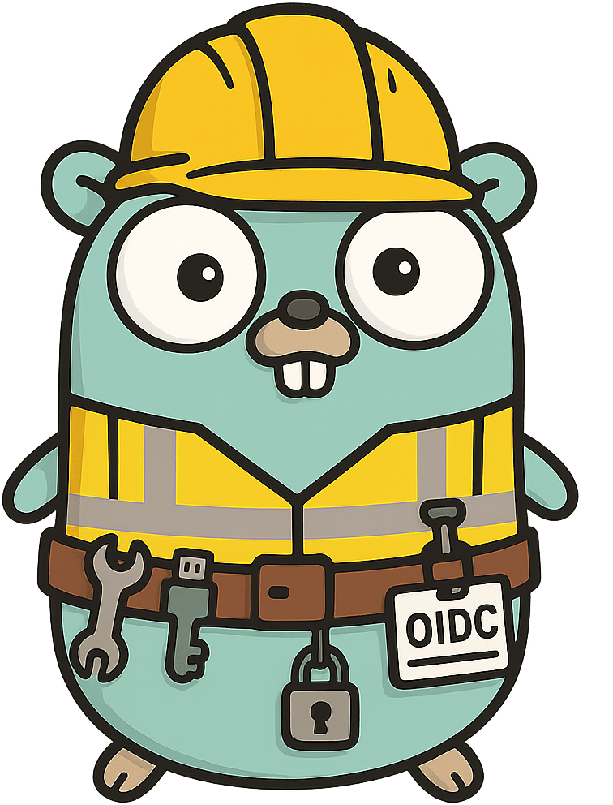
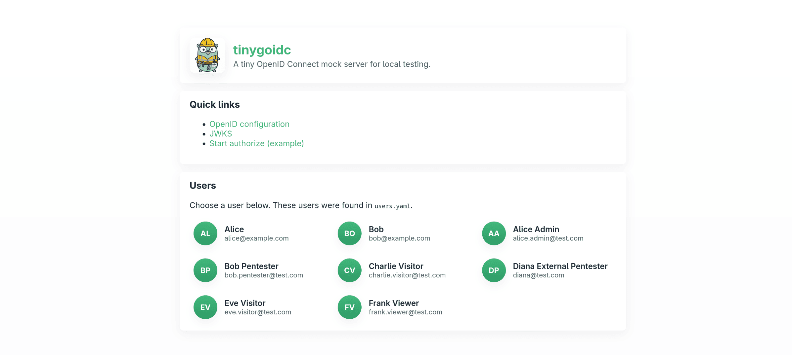
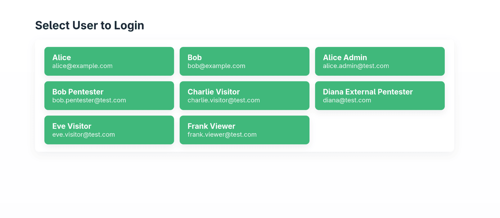

<p align="center">
  <h1 align="center">tinygoidc</h1>
  
  <br>
  <a href="#overview">About</a> •
  <a href="#get-started">Get Started</a> •
  <a href="#configuration">Config</a>
</p>

## Overview

tinygoidc is a tiny, opinionated mock OpenID Connect (OIDC) provider implemented in Go. It's meant for local development and testing when you need a simple issuer that supports the authorization code flow, a JWKS endpoint, and short-lived ID tokens.

Keep it simple — the server ships as a single compiled binary and a small `users.yaml` for test accounts.

> [!WARNING]
> Do not install this in a production environment! This is only meant for local development.  
> Use at your own risk — unless you enjoy explaining to your security team why your “mock OIDC” is suddenly the real one.

## Features

- Authorization code flow (mock login)
- Issues RS256-signed ID tokens
- Exposes `/jwks.json` and `/.well-known/openid-configuration`
- Simple YAML-based user configuration (`users.yaml`)
- Small Docker image (final image uses `FROM scratch`)

## Get Started

### git going fast

```bash
docker run -d --port 9999:9999 ghcr.io/jonasbg/tinygoidc
```

Then use the localhost:9999 as oidc provider in your config such as:
```yaml
oidc:
  clientID: "any-client-id-is-accepted"
  clientSecret: "no-secret-is-needed"
  redirectUri: "http://localhost:5173/api/callback"
  providerUri: "http://localhost:9999"
```

For local development, this mock server accepts any client ID and secret to keep setup quick and simple.

### Build it yourself

Prerequisites:

- Go (for local builds) or Docker (for running the included image)

Run locally with Go:

```bash
go run main.go
```

Build and run with Docker (from repository root):

```bash
docker build -t tinygoidc:latest .
docker run --rm -p 9999:9999 tinygoidc:latest
```

By default the server listens on port 9999 when run with `go run`. When the container runs it exposes port `9999`.

## Configuration

The server reads users from a YAML file. By default it looks for `users.yaml` in the working directory or the path set by the `USERS` environment variable.

Override the users file in Docker by mounting a file or directory at `/config`:

```bash
# Mount a single file
docker run --rm -p 9999:9999 -v $(pwd)/users.yaml:/config/users.yaml tinygoidc:latest

# Or mount a directory
docker run --rm -p 9999:9999 -v $(pwd)/config:/config tinygoidc:latest
```

Environment variables:

- `USERS` — path to the users YAML inside the container (default: `/config/users.yaml`)
- `PORT` — port the app listens on (container default is `9999`, local default is `9999`)

# Screenshots

Landing page


Login page


## Quick reference

- Authorization endpoint: /authorize
- Token endpoint: /token
- JWKS endpoint: /jwks.json
- Discovery: /.well-known/openid-configuration

## License

This project is licensed under the MIT License.